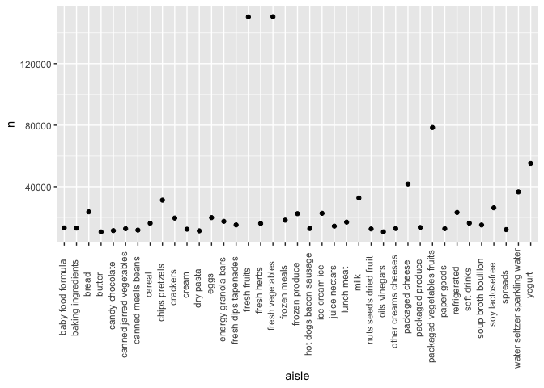

Simple document
================
Catherine Mauro
2021-10-20

# Problem 1

First, we should load the **tidyverse** into our code.

``` r
library(tidyverse)
```

    ## ── Attaching packages ─────────────────────────────────────── tidyverse 1.3.1 ──

    ## ✓ ggplot2 3.3.5     ✓ purrr   0.3.4
    ## ✓ tibble  3.1.4     ✓ dplyr   1.0.7
    ## ✓ tidyr   1.1.3     ✓ stringr 1.4.0
    ## ✓ readr   2.0.1     ✓ forcats 0.5.1

    ## ── Conflicts ────────────────────────────────────────── tidyverse_conflicts() ──
    ## x dplyr::filter() masks stats::filter()
    ## x dplyr::lag()    masks stats::lag()

Next, we can upload our **Instacart** data using the *p8105.datasets*
code provided on the website.

``` r
library(p8105.datasets)
data("instacart")
```

After loading the set, we can observe some details regarding the data:

There are 1384617 rows and 15 columns in **instacart**.

The variables include order\_id, product\_id, add\_to\_cart\_order,
reordered, user\_id, eval\_set, order\_number, order\_dow,
order\_hour\_of\_day, days\_since\_prior\_order, product\_name,
aisle\_id, department\_id, aisle, department. Columns like order,
product, and user id record unique numeric identifiers, while product
name and department record descriptive character observations from the
data.

Nest, we can write some code to find more about our **instacart** data.

``` r
instacart %>%
  count(aisle) %>%
  arrange(desc(n))
```

    ## # A tibble: 134 × 2
    ##    aisle                              n
    ##    <chr>                          <int>
    ##  1 fresh vegetables              150609
    ##  2 fresh fruits                  150473
    ##  3 packaged vegetables fruits     78493
    ##  4 yogurt                         55240
    ##  5 packaged cheese                41699
    ##  6 water seltzer sparkling water  36617
    ##  7 milk                           32644
    ##  8 chips pretzels                 31269
    ##  9 soy lactosefree                26240
    ## 10 bread                          23635
    ## # … with 124 more rows

There are 134 aisles. The aisles with the most items include *fresh
vegetables*, *fresh fruits*, *packaged vegetables fruits*, *yoghurt*,
and *packaged cheese*, all which have more than **41,000** observations.

Next, we can make a plot to show the number of items ordered in each
aisle for those aisles with more than **10,000** observations.

``` r
instacart %>%
  count(aisle) %>%
  filter(n > 10000) %>%
    mutate(
      is.factor(aisle),
      fct_reorder(aisle, n, desc)
    ) %>%
  ggplot(aes(x = aisle, y = n)) + geom_point() + theme(axis.text.x = element_text
  (angle = 90, hjust = 1, vjust = 3)) +
  labs(
    title = "Aisle Plot",
    x = "Aisle Name",
    y = "Number of Items Ordered",
    caption = "data from p8105.datasets"
  )
```

<!-- -->

After arranging a graph for all of the aisles with over 10000 items
ordered, we can make a table further exploring popular items for *baking
ingredients*, *dog food care*, *packaged vegetables fruits*.

``` r
instacart %>%
  group_by(aisle) %>%
  filter(aisle %in% c("baking ingredients", "dog food care", "packaged vegetables fruits")) %>%
  count(product_name) %>%
  mutate(product_rank_in_aisle = min_rank(desc(n))) %>%
  filter(product_rank_in_aisle <= 3) %>%
  arrange(aisle, product_rank_in_aisle) %>%
  knitr::kable()
```

| aisle                      | product\_name                                 |    n | product\_rank\_in\_aisle |
|:---------------------------|:----------------------------------------------|-----:|-------------------------:|
| baking ingredients         | Light Brown Sugar                             |  499 |                        1 |
| baking ingredients         | Pure Baking Soda                              |  387 |                        2 |
| baking ingredients         | Cane Sugar                                    |  336 |                        3 |
| dog food care              | Snack Sticks Chicken & Rice Recipe Dog Treats |   30 |                        1 |
| dog food care              | Organix Chicken & Brown Rice Recipe           |   28 |                        2 |
| dog food care              | Small Dog Biscuits                            |   26 |                        3 |
| packaged vegetables fruits | Organic Baby Spinach                          | 9784 |                        1 |
| packaged vegetables fruits | Organic Raspberries                           | 5546 |                        2 |
| packaged vegetables fruits | Organic Blueberries                           | 4966 |                        3 |

Finally for this data set, we can create a 2x7 table tracking the mean
hour of day at which certain apples and ice creams are ordered each day
of the week.

``` r
instacart %>%
  group_by(product_name, order_dow) %>%
  filter(product_name %in% c("Pink Lady Apples", "Coffee Ice Cream")) %>%
  summarize(mean_hod = round(mean(order_hour_of_day), 2)) %>%
  pivot_wider(
    names_from = order_dow,
    values_from = mean_hod
  ) %>%
knitr::kable()
```

    ## `summarise()` has grouped output by 'product_name'. You can override using the `.groups` argument.

| product\_name    |     0 |     1 |     2 |     3 |     4 |     5 |     6 |
|:-----------------|------:|------:|------:|------:|------:|------:|------:|
| Coffee Ice Cream | 13.77 | 14.32 | 15.38 | 15.32 | 15.22 | 12.26 | 13.83 |
| Pink Lady Apples | 13.44 | 11.36 | 11.70 | 14.25 | 11.55 | 12.78 | 11.94 |

# Problem 2

First, we can upload our **BRFSS** data using the *p8105.datasets* code
provided on the website.

``` r
library(p8105.datasets)
data("brfss_smart2010")
```

Next, we should do some data cleaning to ensure that the data have
appropriate variable names, focus on the topic at hand, include only
excellent to poor responses, and organize the responses as a factor
taking levels ordered from poor to excellent

``` r
brfss = brfss_smart2010 %>%
  janitor::clean_names() %>%
  filter(topic == "Overall Health", response %in% c("Poor", "Fair", "Good", "Very good", "Excellent")) %>%
  mutate(
    response = factor(response, ordered = TRUE, levels = c("Poor", "Fair", "Good", "Very good", "Excellent")))
```

Now, we can find some answers:

``` r
locations_2002 = brfss %>%
  filter(year == 2002) %>%
  group_by(locationabbr) %>%
  summarize(
    number_of_locations = n_distinct(locationdesc)
  ) %>%
  filter(number_of_locations > 6)

view(locations_2002)
```

There were 6 states that had 7 or more observations in 2002. They
included CT, FL, MA, NC, NJ, PA

``` r
locations_2010 = brfss %>%
  filter(year == 2010) %>%
  group_by(locationabbr) %>%
  summarize(
    number_of_locations = n_distinct(locationdesc)
  ) %>%
  filter(number_of_locations > 6)
```

There were 14 states that had 7 or more observations in 2010. They
included CA, CO, FL, MA, MD, NC, NE, NJ, NY, OH, PA, SC, TX, WA

  

``` r
excellent_brfss = brfss %>%
  filter(response == "Excellent") %>%
  group_by(year, locationabbr) %>%
  summarize(mean_state_data = mean(data_value, na.rm = TRUE))
```

    ## `summarise()` has grouped output by 'year'. You can override using the `.groups` argument.

Now, we can create a *spaghetti plot* using our new **excellent\_brfss**
dataset.

``` r
ggplot(data = excellent_brfss, aes(x = year, y = mean_state_data, color = locationabbr, group = locationabbr)) + geom_line()
```

<!-- -->

``` r
ggplot(subset(brfss, year %in% c(2006, 2010)), aes(x = response, y = data_value, fill = response)) + geom_bar(stat = "identity", position = "dodge") + facet_grid(. ~ year)
```

    ## Warning: Removed 9 rows containing missing values (geom_bar).

<!-- -->
